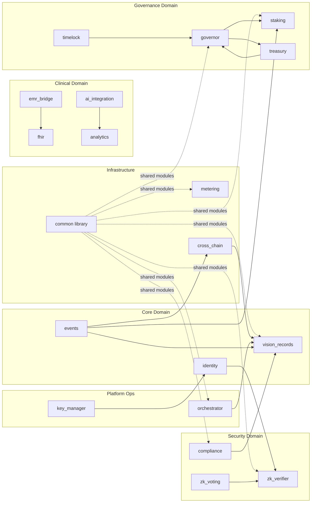
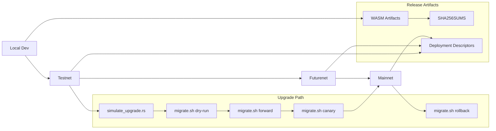

# Architecture Reference

This document is the detailed architecture baseline for Teye Contracts.

## Table of Contents

- [1. Scope and Audience](#1-scope-and-audience)
- [2. System Context (C4)](#2-system-context-c4)
- [3. Contract Component Architecture](#3-contract-component-architecture)
- [4. Storage Architecture](#4-storage-architecture)
- [5. Security Boundaries and Attack Surfaces](#5-security-boundaries-and-attack-surfaces)
- [6. Deployment and Upgrade Architecture](#6-deployment-and-upgrade-architecture)
- [7. Data Flow Reference](#7-data-flow-reference)
- [8. Cross-References](#8-cross-references)

## 1. Scope and Audience

This reference is intended for:

- Auditors validating contract boundaries and trust assumptions.
- Maintainers planning upgrades and incident response.
- Integrators wiring applications, indexers, and off-chain services.

Contract set represented here: 19 production architecture components grouped by domain.

## 2. System Context (C4)

```mermaid
flowchart TB
  %% C4-style context diagram (Person/System/System_Ext mapped into Mermaid flowchart)
  patient[Patient]
  provider[Provider]
  admin[System Admin]
  aiop[AI Operator]
  bridgeop[Bridge Relayer]

  subgraph teye[Teye Contract System (Bounded Context)]
    teyeContracts[Teye Smart Contract Platform\n(Soroban contracts: identity, records, governance,\nprivacy, analytics, interoperability)]
  end

  stellar[Stellar / Soroban Network]
  ipfs[Off-chain Encrypted Storage]
  fhirSrv[FHIR / EMR Servers]
  zkInfra[ZK Proving Systems]
  aiInfra[AI Inference Services]
  otherChains[External Chains]

  patient -->|register, consent, access checks| teyeContracts
  provider -->|write/read clinical records| teyeContracts
  admin -->|admin ops, pause, upgrades| teyeContracts
  aiop -->|submit analysis results| teyeContracts
  bridgeop -->|submit cross-chain relay payloads| teyeContracts

  teyeContracts -->|execute| stellar
  teyeContracts -->|hash/pointer references| ipfs
  teyeContracts -->|mapped exchange workflows| fhirSrv
  teyeContracts -->|verify submitted proofs| zkInfra
  teyeContracts -->|orchestrate AI request lifecycle| aiInfra
  teyeContracts -->|import/anchor external state| otherChains
```

## 3. Contract Component Architecture

### 3.1 Domain Map and Dependencies



### 3.2 Contract Notes

- `common` is a shared Rust library and not deployed as an independent Soroban contract.
- `timelock` is represented as a governance boundary and execution delay mechanism (including `contracts/timelock/Timelock.sol` artifact and governor timelock phases).
- `audit` is used as a reusable integrity module (hashing/consistency helpers) by `staking` and `compliance`, but is treated as a supporting library in this 19-component architecture view.
- Inter-contract runtime links are strongest around governance (`governor` <-> `treasury`/`staking`) and privacy (`identity`/`zk_verifier`/`zk_voting`).

### 3.3 Component Inventory (19)

`vision_records`, `identity`, `events`, `fhir`, `emr_bridge`, `analytics`, `ai_integration`, `compliance`, `zk_verifier`, `zk_voting`, `governor`, `timelock`, `treasury`, `staking`, `common`, `metering`, `cross_chain`, `key_manager`, `orchestrator`.

## 4. Storage Architecture

### 4.1 Storage Model by Contract Family

| Domain | Contracts | Primary Storage Patterns |
|---|---|---|
| Core | `vision_records`, `identity`, `events` | `instance` for admin/config/counters, `persistent` for records/roles/audit indexes, `temporary` for prepare/commit workflows |
| Clinical | `fhir`, `emr_bridge`, `analytics`, `ai_integration` | `instance` for config/admin, `persistent` for provider registries, exchanges, metrics, AI requests/results |
| Security | `compliance`, `zk_verifier`, `zk_voting` | `persistent` for revocation/audit/voting state, `instance` for verifier/admin config |
| Governance | `staking`, `governor`, `timelock`, `treasury` | `instance` for global parameters, `persistent` for proposals/delegations/stakes/approvals |
| Infrastructure | `common`, `metering`, `cross_chain` | shared key helpers (`common`), `persistent` for tenant usage and bridge state roots/identity maps |
| Platform Ops | `key_manager`, `orchestrator` | `instance` for admin/config pointers, `persistent` for key metadata and orchestration transaction state |

### 4.2 TTL Strategy

TTL is explicitly extended in several contracts to keep critical records alive while controlling rent.

| Contract/Module | `TTL_THRESHOLD` | `TTL_EXTEND_TO` | Purpose |
|---|---:|---:|---|
| `vision_records::emergency` | `5,184,000` | `10,368,000` | Emergency grants and audit continuity |
| `identity::recovery` | `5,184,000` | `10,368,000` | Guardian/recovery survivability |
| `metering::gas_token` | `5,184,000` | `10,368,000` | Tenant token balances/flags |
| `emr_bridge` | `17,280` | `518,400` | Provider/exchange mappings |
| `cross_chain` (+ `relay`) | `17,280` | `518,400` | Relayer status, identity maps, anchored roots |
| `governor` modules | `518,400` to `1,036,800`+ | `1,036,800` to `2,073,600`+ | Proposal, delegation, vote-commit lifecycle |

Contracts without explicit TTL extension depend on Soroban defaults and storage access patterns.

### 4.3 Key Namespacing Conventions

The project follows `symbol_short!` conventions documented in [docs/storage-key-conventions.md](storage-key-conventions.md):

- max key token length: 9 chars
- uppercase abbreviated prefixes (`ADMIN`, `INIT`, `PEND_ADM`, etc.)
- tuple keys for scoped domains, e.g. `(Symbol, Address)`, `(Symbol, u64)`, `(Symbol, Address, Address)`

CI storage-key collision checks are implemented in `scripts/check_storage_keys.sh`.

### 4.4 Data Volume and Cost Considerations

Estimated growth drivers:

- `vision_records`: O(records + grants + audit entries)
- `events`: O(total published events + topic indexes + subscriptions)
- `governor`: O(proposals + votes + commits + delegations)
- `metering`: O(tenants x billing cycles x operation counters)

Operational guidance:

- keep high-churn logs indexed and compacted where possible (`events` replay/compaction features)
- maintain TTL extension for long-lived safety-critical data only
- monitor storage growth and near-limit thresholds in monitoring dashboards

## 5. Security Boundaries and Attack Surfaces

### 5.1 Trust Boundary Diagram

```mermaid
flowchart TB
  subgraph OnChain[On-chain Trusted Execution Boundary]
    contracts[Teye Contracts\n(access control, audit events, policy, hashes)]
    ledger[Stellar Ledger / Soroban Runtime]
    contracts --> ledger
  end

  subgraph OffChain[Off-chain Systems Boundary]
    apps[Client Apps / APIs]
    enc[Encrypted Clinical Data Store]
    ai[AI Inference Workers]
    zk[ZK Provers]
    keys[Key Custody / HSM / Multisig Ops]
  end

  subgraph External[External Networks Boundary]
    emr[FHIR / EMR Systems]
    bridge[Cross-chain Relayers]
    chains[Other Chains]
  end

  apps --> contracts
  contracts --> enc
  ai --> contracts
  zk --> contracts
  keys --> contracts
  emr --> contracts
  bridge --> contracts
  bridge --> chains

  classDef boundary fill:#f8f9fa,stroke:#333,stroke-width:1px;
  class OnChain,OffChain,External boundary;
```

### 5.2 Boundary Controls

- On-chain controls: auth checks, RBAC, multisig hooks, proposal timelocks, append-only audit/event logs.
- Off-chain controls: encryption key custody, secure AI pipeline operation, secure witness/proof handling.
- Cross-boundary risks: relay spoofing, key compromise, metadata leakage, stale/offline monitoring.

Threat analysis and controls should be read with:

- [docs/threat-model.md](threat-model.md)
- [docs/security.md](security.md)

## 6. Deployment and Upgrade Architecture



Deployment and upgrade procedures:

- [docs/deployment.md](deployment.md)
- [docs/upgrade_procedures.md](upgrade_procedures.md)
- [docs/runbook/deployment.md](runbook/deployment.md)
- [docs/runbook/upgrades.md](runbook/upgrades.md)

## 7. Data Flow Reference

Detailed sequence diagrams are maintained in:

- [docs/data-flows.md](data-flows.md)

Included workflows:

- Patient registration -> first record -> delegation
- Governance proposal lifecycle
- AI analysis pipeline
- Cross-chain bridge transfer
- Emergency access grant/revocation
- ZK proof verification

## 8. Cross-References

- [docs/api.md](api.md)
- [docs/monitoring.md](monitoring.md)
- [docs/incident-response-plan.md](incident-response-plan.md)
- [docs/security-audit-checklist.md](security-audit-checklist.md)
