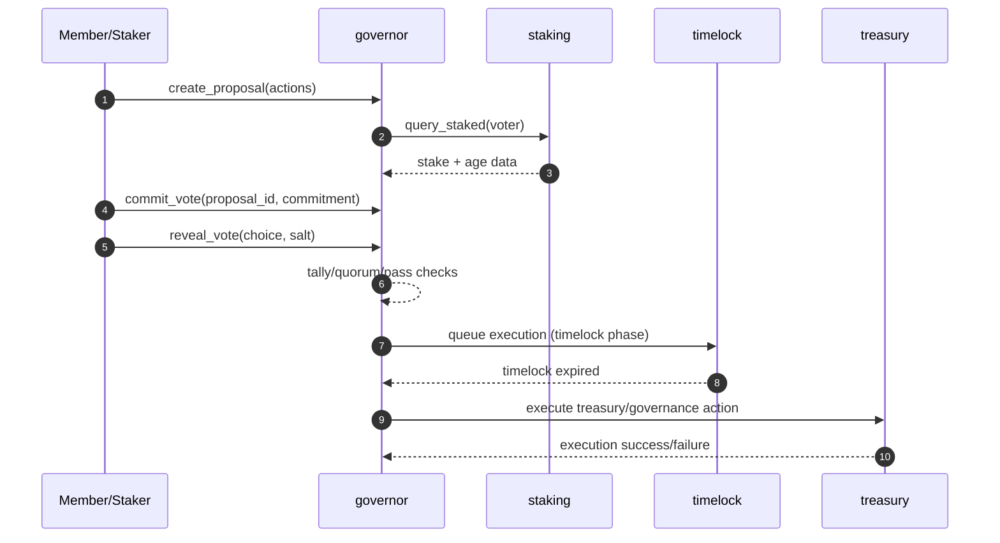
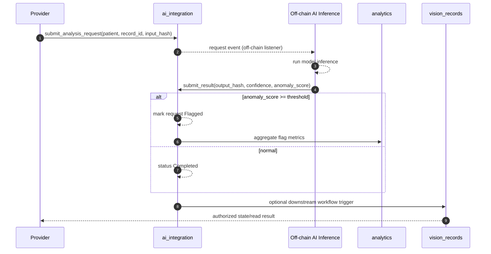
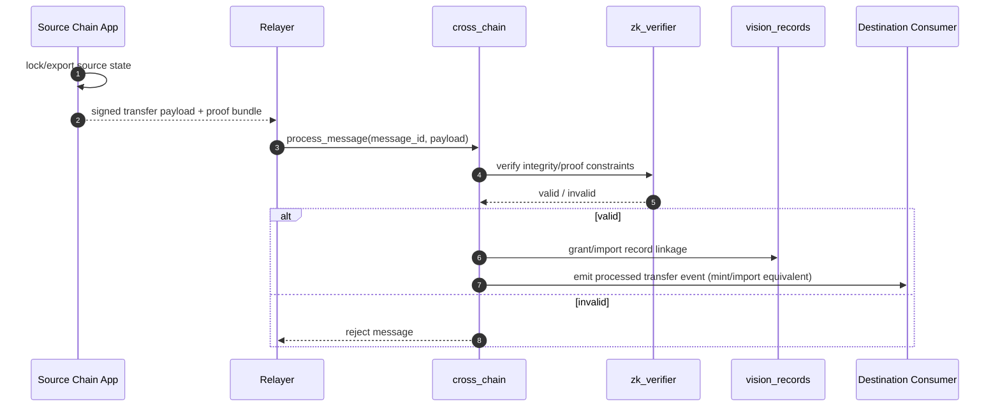
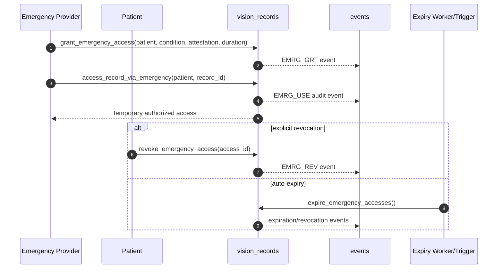
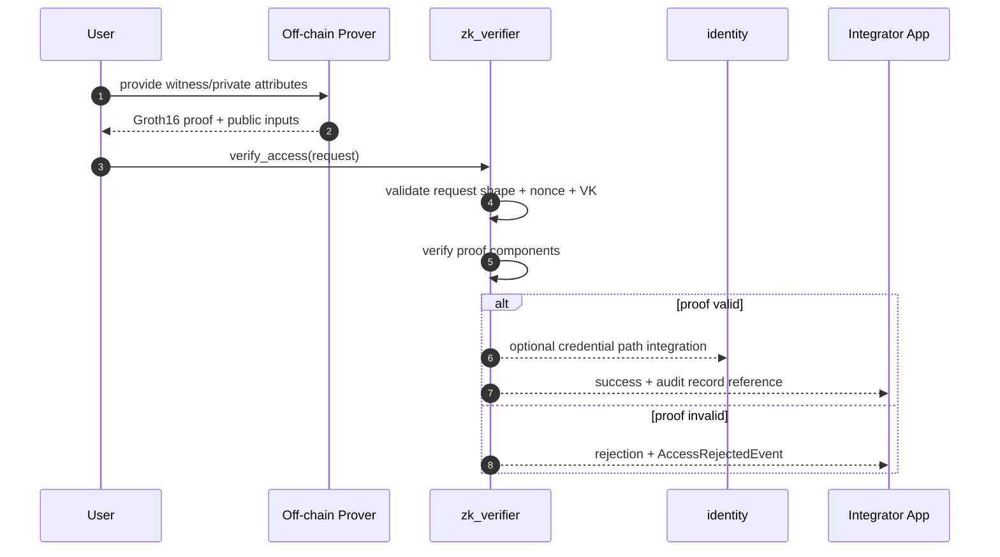

# Data Flow Diagrams

This document contains sequence diagrams for critical Teye workflows.

## Table of Contents

- [1. Patient Registration to First Record to Access Delegation](#1-patient-registration-to-first-record-to-access-delegation)
- [2. Governance Proposal Lifecycle](#2-governance-proposal-lifecycle)
- [3. AI Analysis Pipeline](#3-ai-analysis-pipeline)
- [4. Cross-Chain Bridge Transfer](#4-cross-chain-bridge-transfer)
- [5. Emergency Access Grant and Auto-Revocation](#5-emergency-access-grant-and-auto-revocation)
- [6. ZK Proof Verification](#6-zk-proof-verification)

## 1. Patient Registration to First Record to Access Delegation

```mermaid
sequenceDiagram
  autonumber
  participant P as Patient
  participant Pr as Provider
  participant VR as vision_records
  participant ID as identity
  participant EV as events
  participant OFF as Off-chain Encrypted Storage

  P->>ID: initialize / identity registration
  P->>VR: register_user(patient)
  VR-->>EV: publish_user_registered

  Pr->>VR: register_user(provider)
  Pr->>OFF: encrypt exam payload
  Pr->>VR: add_record(patient, provider, data_hash)
  VR-->>EV: publish_record_added

  P->>VR: grant_access(patient, grantee, level, expires)
  VR-->>EV: publish_access_granted
  Pr->>VR: get_record(record_id)
  VR-->>Pr: hashed metadata + authorization result
```

## 2. Governance Proposal Lifecycle



## 3. AI Analysis Pipeline



## 4. Cross-Chain Bridge Transfer



## 5. Emergency Access Grant and Auto-Revocation



## 6. ZK Proof Verification


